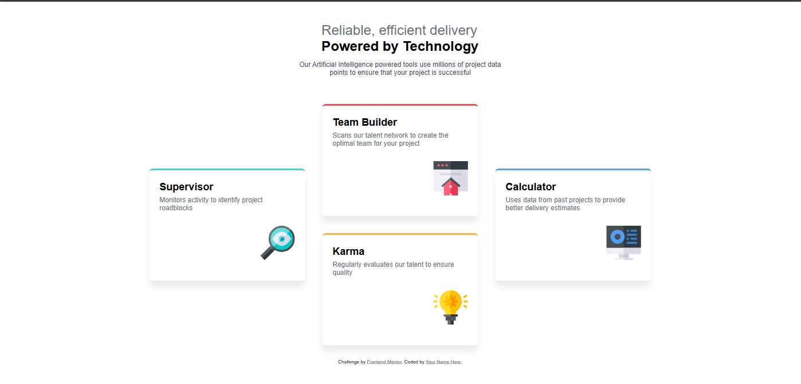

# Frontend Mentor - Four card feature section solution

This is a solution to the [Four card feature section challenge on Frontend Mentor](https://www.frontendmentor.io/challenges/four-card-feature-section-weK1eFYK). Frontend Mentor challenges help you improve your coding skills by building realistic projects.

## Table of contents

- [Overview](#overview)
  - [The challenge](#the-challenge)
  - [Screenshot](#screenshot)
  - [Links](#links)
- [My process](#my-process)
  - [Built with](#built-with)
  - [What I learned](#what-i-learned)
  - [Continued development](#continued-development)
  - [AI Collaboration](#ai-collaboration)
- [Author](#author)
- [Acknowledgments](#acknowledgments)

## Overview

### The challenge

Users should be able to:

- View the optimal layout for the site depending on their device's screen size

### Screenshot



### Links

- Solution URL: [Add solution URL here](https://your-solution-url.com)
- Live Site URL: [Add live site URL here](https://your-live-site-url.com)

## My process

### Built with

- Semantic HTML5 markup
- CSS custom properties
- Flexbox
- CSS Grid
- Mobile-first workflow

### What I learned

This project reinforced my knowledge on "grid-template-areas" where I learnt about a new CSS property and property-value called "align-self: center;" this helped in the positioning of the cards.
Also, I learnt about the characteristic working of the box-shadow property in order to facilitate a soft lift look on the cards.

```css
.supervisor {
  border-top: 4px solid var(--CYAN);
  align-self: center;
  grid-area: su;
}
```

### Continued development

Oh, I really look forward to mastering the amazing object-oriented programming language, JavaScript.

### AI Collaboration

Anytime I met a stumbling block I couldn't dismantle, I approached DeepSeek AI to clear confusion and foster better understanding.

## Author

- Website - [Add your name here](https://www.your-site.com)
- Frontend Mentor - [@The-Queen-Builds](https://www.frontendmentor.io/profile/The-Queen-Builds)
- Twitter - [@EbimoboereLaye](https://www.twitter.com/EbimoboereLaye)

## Acknowledgments

I appreciate God almighty for blessing and favouring me beyound measure. I look forward to creating and building things that bless and glorify his name.
